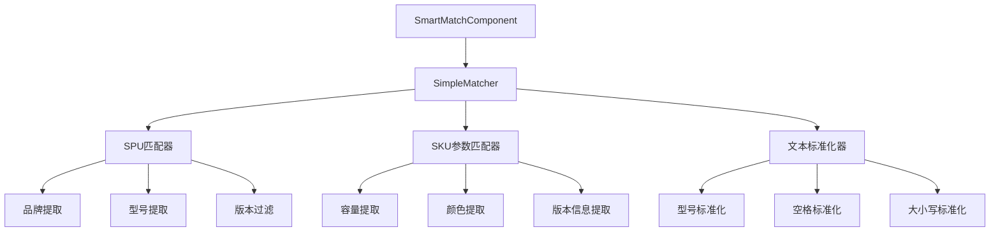

# 智能匹配准确率优化 - 设计文档

## 1. 概述

本设计文档描述了如何将智能匹配系统的准确率从当前的15.3%提升至85%以上。核心策略是改进SPU匹配阶段的版本过滤、型号识别，以及SKU参数匹配阶段的颜色和容量提取。

### 1.1 设计目标

- 将整体匹配准确率从15.3%提升至85%以上
- 解决SPU匹配到错误版本的问题（礼盒版、eSIM版等）
- 改进型号识别，支持WatchGT、Watch5等特殊格式
- 增强颜色识别，支持"可可黑"、"薄荷青"等特殊颜色名称
- 保持单条匹配响应时间在2秒以内

### 1.2 设计原则

- **分阶段匹配**：先匹配SPU（品牌+型号），再匹配SKU（容量+颜色）
- **版本优先级**：标准版 > 特殊版（礼盒版、系列版）
- **动态数据驱动**：颜色列表从实际SKU数据中提取
- **向后兼容**：保持现有SDK接口和UI交互方式

## 2. 架构设计

### 2.1 整体架构

系统采用三阶段匹配流程：

```
输入商品名称
    ↓
[阶段1] SPU匹配（品牌+型号+版本过滤）
    ↓
[阶段2] SKU加载（获取该SPU的所有在用SKU）
    ↓
[阶段3] SKU参数匹配（容量+颜色）
    ↓
输出匹配结果
```


### 2.2 组件架构



### 2.3 数据流

1. **初始化阶段**
   - 加载所有在用SPU数据
   - 从采样的SPU中提取动态颜色列表
   - 加载品牌数据

2. **匹配阶段**
   - 用户输入商品名称（支持批量）
   - 对每条输入执行三阶段匹配
   - 实时更新UI显示匹配进度和结果

3. **结果展示阶段**
   - 显示匹配状态（已匹配/未匹配/匹配中）
   - 显示相似度评分
   - 支持导出CSV

## 3. 核心组件设计

### 3.1 SimpleMatcher 类

SimpleMatcher 是核心匹配引擎，负责所有匹配逻辑。

#### 3.1.1 类结构

```typescript
class SimpleMatcher {
  private dynamicColors: string[] = [];
  
  // 设置动态颜色列表
  setColorList(colors: string[]): void
  
  // 文本标准化
  normalize(str: string): string
  
  // 信息提取方法
  extractBrand(str: string): string | null
  extractModel(str: string): string | null
  extractCapacity(str: string): string | null
  extractColor(str: string): string | null
  extractSPUPart(str: string): string
  
  // 匹配方法
  findBestSPUMatch(input: string, spuList: SPUData[], threshold: number): MatchResult
  findBestSKUInList(input: string, skuList: SKUData[]): MatchResult
  calculateSimilarity(str1: string, str2: string): number
}
```


### 3.2 型号提取与标准化

#### 3.2.1 型号标准化规则

型号标准化是解决WatchGT、Watch5等问题的关键。

**标准化映射表**：
```typescript
const modelNormalizations = {
  'promini': 'pro mini',
  'promax': 'pro max',
  'proplus': 'pro plus',
  'watchgt': 'watch gt',
  'watchse': 'watch se',
  'watch3': 'watch 3',
  'watch5': 'watch 5',
  // ... 更多映射
};
```

**标准化流程**：
1. 转换为小写
2. 应用连写型号映射（promini → pro mini）
3. 标准化数字空格（Watch5 → Watch 5）
4. 移除括号内的型号代码（如（WA2456C））

#### 3.2.2 型号提取策略

采用多层次匹配策略，按优先级依次尝试：

**优先级1：字母+字母格式**（如 WATCH GT, X Note）
```regex
/\b(watch|band|buds|pad|fold|flip|note)\s+(gt|se|pro|max|plus|ultra|air|lite|[a-z]+\d*)\b/gi
```

**优先级2：复杂型号格式**（如 S30 Pro mini, iPhone 15 Pro Max）
```regex
/\b([a-z]+)\s*(\d+)\s*(pro|max|plus|ultra|mini|se|air|lite|note)(\s+(mini|max|plus|ultra))?\b/gi
```

**优先级3：简单型号格式**（如 Y300i, Mate60）
```regex
/\b([a-z]+)(\d+)([a-z]*)\b/gi
```

**过滤规则**：
- 排除网络制式：5g, 4g, 3g
- 排除容量：包含gb的匹配
- 排除纯数字+g：8g, 12g

### 3.3 SPU版本过滤

#### 3.3.1 版本分类

将SPU分为以下类别：
- **标准版**：不包含特殊标识的SPU
- **礼盒版**：包含"礼盒"、"套装"、"系列"等关键词
- **特殊版本**：包含"eSIM版"、"特别版"等

#### 3.3.2 过滤规则

```typescript
function shouldFilterSPU(inputName: string, spuName: string): boolean {
  // 规则1：输入不包含"礼盒"时，过滤掉礼盒版SPU
  if (!inputName.includes('礼盒') && 
      (spuName.includes('礼盒') || spuName.includes('套装') || spuName.includes('系列'))) {
    return true;
  }
  
  // 规则2：输入包含"蓝牙版"时，过滤掉eSIM版SPU
  if (inputName.includes('蓝牙版') && spuName.includes('eSIM版')) {
    return true;
  }
  
  // 规则3：输入包含"eSIM版"时，过滤掉蓝牙版SPU
  if (inputName.includes('eSIM版') && spuName.includes('蓝牙版')) {
    return true;
  }
  
  return false;
}
```

#### 3.3.3 优先级排序

在多个SPU匹配时，按以下优先级排序：
1. 标准版（不含特殊标识）
2. 版本匹配的特殊版（如输入包含"蓝牙版"，SPU也包含"蓝牙版"）
3. 其他特殊版


### 3.4 颜色识别增强

#### 3.4.1 动态颜色列表

从实际SKU数据中提取颜色列表，而不是使用硬编码的颜色列表。

**提取流程**：
1. 采样前200个SPU
2. 获取每个SPU的SKU信息
3. 从SKU的color字段提取颜色
4. 按长度降序排序（优先匹配更长的颜色词）

**优势**：
- 自动包含所有实际使用的颜色
- 支持特殊颜色名称（可可黑、薄荷青、柠檬黄等）
- 随着数据更新自动更新

#### 3.4.2 颜色提取策略

采用多种方法提取颜色，按优先级依次尝试：

**方法1：动态颜色列表匹配**
```typescript
for (const color of this.dynamicColors) {
  if (str.includes(color)) {
    return color;
  }
}
```

**方法2：从字符串末尾提取**
```typescript
const lastWords = str.match(/[\u4e00-\u9fa5]{2,5}$/);
// 排除非颜色词：全网通、网通、版本、标准、套餐
```

**方法3：从容量后提取**
```typescript
const afterCapacity = str.match(/\d+GB[+]\d+GB\s*([\u4e00-\u9fa5]{2,5})/);
```

**方法4：基础颜色后备**
```typescript
const basicColors = ['黑', '白', '蓝', '红', '绿', '紫', '粉', '金', '银', '灰'];
```

#### 3.4.3 颜色变体映射

支持颜色变体的等价匹配：
```typescript
const colorVariants = {
  '雾凇蓝': ['雾松蓝'],
  '雾松蓝': ['雾凇蓝'],
  // 可扩展更多变体
};
```

### 3.5 容量提取

#### 3.5.1 支持的格式

- 括号格式：`(12+512)`, `(12GB+512GB)`
- 无括号格式：`12+512`, `12GB+512GB`
- 单容量格式：`256GB`, `512GB`

#### 3.5.2 提取正则表达式

```typescript
// 1. 括号内容量
const bracketPattern = /\((\d+)\s*(?:gb)?\s*\+\s*(\d+)\s*(?:gb)?\)/gi;

// 2. 无括号容量
const capacityPattern = /(\d+)\s*(?:gb)?\s*\+\s*(\d+)\s*(?:gb)?/gi;

// 3. 单个容量
const singlePattern = /(\d+)\s*gb/gi;
```

#### 3.5.3 标准化输出

统一输出格式为 `12+512`（去除GB单位）


### 3.6 相似度计算

#### 3.6.1 SPU相似度计算

SPU匹配阶段的相似度计算基于品牌和型号：

```typescript
function calculateSPUSimilarity(input: string, spu: SPUData): number {
  const inputBrand = extractBrand(input);
  const inputModel = extractModel(input);
  const spuBrand = extractBrand(spu.name);
  const spuModel = extractModel(spu.name);
  
  let score = 0;
  
  // 品牌匹配（权重40%）- 必须匹配
  if (inputBrand && spuBrand) {
    if (inputBrand === spuBrand) {
      score += 0.4;
    } else {
      return 0; // 品牌不匹配，直接拒绝
    }
  }
  
  // 型号匹配（权重60%）- 必须匹配
  if (inputModel && spuModel) {
    if (inputModel === spuModel) {
      score += 0.6;
    } else {
      return 0; // 型号不匹配，直接拒绝
    }
  }
  
  return score;
}
```

**阈值设置**：
- SPU匹配阈值：≥ 0.5（50%）
- 品牌和型号必须同时匹配才能通过

#### 3.6.2 SKU参数相似度计算

SKU匹配阶段的相似度计算基于容量和颜色：

```typescript
function calculateSKUSimilarity(input: string, sku: SKUData): number {
  const inputCapacity = extractCapacity(input);
  const inputColor = extractColor(input);
  const skuCapacity = extractCapacity(sku.name);
  const skuColor = extractColor(sku.name);
  
  let score = 0;
  let weight = 0;
  
  // 容量匹配（权重70%）
  if (inputCapacity && skuCapacity) {
    weight += 0.7;
    if (inputCapacity === skuCapacity) {
      score += 0.7;
    }
  }
  
  // 颜色匹配（权重30%）
  if (inputColor && skuColor) {
    weight += 0.3;
    if (inputColor === skuColor) {
      score += 0.3; // 完全匹配
    } else if (isColorVariant(inputColor, skuColor)) {
      score += 0.3; // 变体匹配（如雾凇/雾松）
    } else if (hasColorInclusion(inputColor, skuColor)) {
      score += 0.2; // 包含关系
    } else if (hasSameBasicColor(inputColor, skuColor)) {
      score += 0.1; // 基础颜色相同
    }
  }
  
  return weight > 0 ? score / weight : 0.8; // 无参数时返回默认分数
}
```

**阈值设置**：
- SKU参数匹配阈值：≥ 0.7（70%）

#### 3.6.3 综合相似度

最终相似度是SPU相似度和SKU相似度的加权平均：

```typescript
finalSimilarity = spuSimilarity * 0.5 + skuSimilarity * 0.5;
```

**综合阈值**：≥ 0.65（65%）


## 4. 数据模型

### 4.1 核心数据结构

#### 4.1.1 MatchResult

```typescript
interface MatchResult {
  inputName: string;           // 输入的商品名称
  matchedSKU: string | null;   // 匹配的SKU名称
  matchedSPU: string | null;   // 匹配的SPU名称
  matchedBrand: string | null; // 匹配的品牌
  matchedVersion: string | null; // 版本信息
  matchedMemory: string | null;  // 内存/容量
  matchedColor: string | null;   // 颜色
  matchedGtins: string[];        // 69码数组
  similarity: number;            // 相似度（0-1）
  status: 'matched' | 'unmatched' | 'spu-matched'; // 匹配状态
}
```

**状态说明**：
- `matched`: 完全匹配（SPU和SKU都匹配）
- `spu-matched`: SPU已匹配，正在匹配SKU
- `unmatched`: 未匹配

#### 4.1.2 SPUData

```typescript
interface SPUData {
  id: number;      // SPU ID
  name: string;    // SPU名称
  brand?: string;  // 品牌
}
```

#### 4.1.3 SKUData

```typescript
interface SKUData {
  id: number;          // SKU ID
  name: string;        // SKU名称
  spuID?: number;      // 所属SPU ID
  spuName?: string;    // 所属SPU名称
  brand?: string;      // 品牌
  version?: string;    // 版本（蓝牙版、eSIM版等）
  memory?: string;     // 内存/容量
  color?: string;      // 颜色
  gtins?: string[];    // 69码数组
}
```

### 4.2 配置数据

#### 4.2.1 型号标准化映射

```typescript
const MODEL_NORMALIZATIONS: Record<string, string> = {
  'promini': 'pro mini',
  'promax': 'pro max',
  'proplus': 'pro plus',
  'watchgt': 'watch gt',
  'watchse': 'watch se',
  'watch3': 'watch 3',
  'watch5': 'watch 5',
  'watch6': 'watch 6',
  'watch7': 'watch 7',
};
```

#### 4.2.2 版本过滤关键词

```typescript
const GIFT_BOX_KEYWORDS = ['礼盒', '套装', '系列'];
const VERSION_KEYWORDS = ['蓝牙版', 'eSIM版', '5G版', '4G版'];
const MATERIAL_KEYWORDS = ['软胶', '硅胶', '皮革', '陶瓷', '玻璃'];
```

#### 4.2.3 颜色变体映射

```typescript
const COLOR_VARIANTS: Record<string, string[]> = {
  '雾凇蓝': ['雾松蓝'],
  '雾松蓝': ['雾凇蓝'],
  // 可扩展
};
```


## 5. 正确性属性 (Correctness Properties)

正确性属性是系统应该满足的通用规则，通过属性测试（Property-Based Testing）来验证这些规则在各种输入下都成立。

### 5.1 型号标准化属性

**Property 1: 复合型号标准化一致性**

*For any* 产品名称包含复合型号（如"S30Promini"、"WatchGT"），标准化后的型号应该与其空格分隔版本（如"S30 Pro mini"、"Watch GT"）的标准化结果相同。

**Validates: Requirements 2.3.1, 2.3.2**

**Property 2: 数字空格标准化一致性**

*For any* 产品名称包含"字母+数字"格式的型号（如"Watch5"），标准化后应该与其空格分隔版本（"Watch 5"）的标准化结果相同。

**Validates: Requirements 2.3.3**

**Property 3: 大小写标准化一致性**

*For any* 产品名称，不同大小写形式（如"WATCH GT"、"Watch GT"、"watch gt"）的标准化结果应该相同。

**Validates: Requirements 2.3.2**

### 5.2 版本过滤属性

**Property 4: 礼盒版过滤**

*For any* 不包含"礼盒"、"套装"、"系列"关键词的输入，匹配结果中的SPU名称不应包含这些关键词。

**Validates: Requirements 2.2.1, 3.1.1**

**Property 5: 版本互斥过滤**

*For any* 包含"蓝牙版"的输入，匹配结果中的SPU名称不应包含"eSIM版"；反之亦然。

**Validates: Requirements 2.2.2, 3.1.2**

**Property 6: 标准版本优先级**

*For any* 输入，当存在多个相似度相同的SPU匹配时，不包含特殊版本关键词（礼盒、系列、eSIM等）的SPU应该被优先选择。

**Validates: Requirements 2.2.3, 3.1.3**


### 5.3 颜色识别属性

**Property 7: 特殊颜色名称识别**

*For any* 产品名称包含特殊颜色名称（如"可可黑"、"薄荷青"、"柠檬黄"、"酷莓粉"），颜色提取函数应该能够正确识别并返回该颜色。

**Validates: Requirements 2.4.1, 3.2.2**

**Property 8: 带修饰词颜色识别**

*For any* 产品名称包含带修饰词的颜色（如"夏夜黑"、"辰夜黑"、"龙晶紫"），颜色提取函数应该能够正确识别并返回完整的颜色名称（包括修饰词）。

**Validates: Requirements 2.4.2, 3.2.3**

**Property 9: 颜色变体等价性**

*For any* 两个产品名称，如果它们的颜色是已知的变体对（如"雾凇蓝"和"雾松蓝"），则颜色匹配应该返回相同的相似度分数，就像它们是完全相同的颜色一样。

**Validates: Requirements 2.4.3, 3.2.4**

### 5.4 容量提取属性

**Property 10: 容量格式标准化**

*For any* 产品名称包含容量信息（无论是"(12+512)"、"12GB+512GB"还是"12+512"格式），提取后的容量应该统一为标准格式"12+512"。

**Validates: Requirements 3.2.2 (容量提取增强)**

### 5.5 匹配一致性属性

**Property 11: 品牌型号匹配必要性**

*For any* 成功匹配的结果，输入的品牌和型号必须与匹配的SPU的品牌和型号相同（经过标准化后）。

**Validates: Requirements 3.3.1 (SPU匹配阶段)**

**Property 12: 参数匹配一致性**

*For any* 成功匹配的SKU，如果输入包含容量信息，则匹配的SKU的容量应该与输入的容量相同；如果输入包含颜色信息，则匹配的SKU的颜色应该与输入的颜色相同或为已知变体。

**Validates: Requirements 3.3.3 (参数匹配阶段)**


## 6. 错误处理

### 6.1 匹配失败场景

#### 6.1.1 SPU未匹配

**场景**：无法找到匹配的SPU

**原因**：
- 品牌识别失败
- 型号识别失败
- 所有SPU相似度低于阈值

**处理**：
- 返回状态：`unmatched`
- 相似度：0
- 日志记录：记录提取的品牌和型号信息

#### 6.1.2 SKU未匹配

**场景**：SPU已匹配，但无法找到匹配的SKU

**原因**：
- 该SPU没有在用的SKU
- 容量或颜色参数不匹配
- 所有SKU相似度低于阈值

**处理**：
- 返回状态：`unmatched`
- 保留已匹配的SPU信息
- 日志记录：记录提取的容量和颜色信息

#### 6.1.3 数据加载失败

**场景**：无法加载SPU或SKU数据

**原因**：
- 网络错误
- API错误
- 权限问题

**处理**：
- 显示错误提示
- 允许用户重试
- 记录错误日志

### 6.2 边界情况处理

#### 6.2.1 空输入

**处理**：显示警告提示，不执行匹配

#### 6.2.2 特殊字符

**处理**：在标准化阶段移除或转换特殊字符

#### 6.2.3 超长输入

**处理**：截断或拒绝超过合理长度的输入

#### 6.2.4 多个匹配结果

**处理**：选择相似度最高的结果；相似度相同时，优先选择标准版本


## 7. 测试策略

### 7.1 测试方法

本项目采用双重测试策略：

#### 7.1.1 单元测试（Unit Tests）

单元测试用于验证特定的示例、边界情况和错误条件：

**测试范围**：
- 特定的型号标准化示例（如"WatchGT" → "watch gt"）
- 边界情况（空输入、特殊字符、超长输入）
- 错误条件（数据加载失败、无效输入）
- 集成点（SDK调用、UI交互）

**测试框架**：Jest（TypeScript/React项目标准）

#### 7.1.2 属性测试（Property-Based Tests）

属性测试用于验证通用属性在大量随机输入下都成立：

**测试范围**：
- 所有正确性属性（Property 1-12）
- 每个属性测试至少100次迭代
- 使用随机生成的产品名称、品牌、型号、颜色、容量

**测试框架**：fast-check（JavaScript/TypeScript的属性测试库）

**配置要求**：
```typescript
fc.assert(
  fc.property(
    // generators
    (input) => {
      // property test
    }
  ),
  { numRuns: 100 } // 最少100次迭代
);
```

**标签格式**：
```typescript
// Feature: smart-match-accuracy-improvement, Property 1: 复合型号标准化一致性
test('Property 1: Compound model normalization consistency', () => {
  // test implementation
});
```

### 7.2 测试数据

#### 7.2.1 真实测试数据

使用提供的1178条测试数据作为验证集：
- 测试整体准确率是否达到85%
- 分析失败案例
- 调整阈值和权重

#### 7.2.2 生成测试数据

为属性测试生成随机数据：

**品牌生成器**：
```typescript
const brandGen = fc.constantFrom('vivo', 'apple', 'huawei', 'xiaomi', 'oppo');
```

**型号生成器**：
```typescript
const modelGen = fc.oneof(
  fc.constantFrom('Y300i', 'S30 Pro mini', 'Watch GT', 'Watch 5'),
  // 生成随机型号格式
);
```

**颜色生成器**：
```typescript
const colorGen = fc.constantFrom(
  '可可黑', '薄荷青', '柠檬黄', '夏夜黑', '辰夜黑', '雾凇蓝', '雾松蓝'
);
```

**容量生成器**：
```typescript
const capacityGen = fc.tuple(
  fc.constantFrom('8', '12', '16'),
  fc.constantFrom('128', '256', '512', '1024')
).map(([ram, storage]) => `${ram}+${storage}`);
```

### 7.3 测试覆盖率目标

- 代码覆盖率：≥ 80%
- 属性测试覆盖：所有12个正确性属性
- 真实数据准确率：≥ 85%


## 8. 性能考虑

### 8.1 性能目标

- 单条匹配响应时间：< 2秒
- 批量匹配（100条）：< 30秒
- SPU数据加载时间：< 10秒
- 颜色列表提取时间：< 15秒（采样200个SPU）

### 8.2 性能优化策略

#### 8.2.1 数据预加载

- 在组件初始化时加载所有SPU数据
- 提前提取动态颜色列表
- 缓存品牌数据

#### 8.2.2 批量处理优化

- 使用异步处理，避免阻塞UI
- 实时更新结果，提供进度反馈
- 对每条记录独立处理，失败不影响其他记录

#### 8.2.3 算法优化

- 提前过滤不符合条件的SPU（版本过滤）
- 使用早期退出策略（品牌或型号不匹配时立即返回）
- 颜色列表按长度降序排序，优先匹配更长的颜色词

#### 8.2.4 内存优化

- 只加载必要的字段（id, name, brand）
- 采样提取颜色列表，而不是处理所有SPU
- 及时清理不需要的数据

### 8.3 性能监控

在关键操作中添加性能日志：
```typescript
console.time('SPU匹配');
// SPU matching logic
console.timeEnd('SPU匹配');

console.time('SKU参数匹配');
// SKU matching logic
console.timeEnd('SKU参数匹配');
```

## 9. 可维护性设计

### 9.1 配置化

#### 9.1.1 可配置的阈值

```typescript
const CONFIG = {
  SPU_MATCH_THRESHOLD: 0.5,
  SKU_MATCH_THRESHOLD: 0.7,
  FINAL_MATCH_THRESHOLD: 0.65,
  COLOR_SAMPLE_SIZE: 200,
};
```

#### 9.1.2 可扩展的规则

- 型号标准化映射表可以轻松添加新规则
- 版本过滤关键词可以动态配置
- 颜色变体映射可以扩展

### 9.2 日志和调试

#### 9.2.1 详细的匹配日志

```typescript
console.log('=== SPU匹配输入 ===');
console.log('原始输入:', input);
console.log('SPU部分:', inputSPUPart);
console.log('提取品牌:', inputBrand);
console.log('提取型号:', inputModel);
console.log('最佳SPU匹配:', { spu: bestMatch?.name, score: bestScore });
```

#### 9.2.2 失败原因追踪

记录匹配失败的详细原因：
- SPU未匹配：记录提取的品牌和型号
- SKU未匹配：记录提取的容量和颜色
- 相似度不足：记录计算的相似度值

### 9.3 代码组织

#### 9.3.1 单一职责

每个方法只负责一个功能：
- `extractBrand()`: 只提取品牌
- `extractModel()`: 只提取型号
- `extractColor()`: 只提取颜色
- `extractCapacity()`: 只提取容量

#### 9.3.2 可测试性

所有核心逻辑都在 `SimpleMatcher` 类中，可以独立测试，不依赖UI或SDK。

## 10. 实施计划

### 10.1 阶段1：核心算法优化（P0）

**目标**：解决主要的匹配失败问题

**任务**：
1. 实现SPU版本过滤逻辑
2. 增强型号提取和标准化
3. 实现动态颜色列表提取
4. 更新相似度计算逻辑

**预期提升**：准确率从15.3%提升至60%+

### 10.2 阶段2：参数匹配优化（P1）

**目标**：提高SKU参数匹配准确率

**任务**：
1. 优化容量提取逻辑
2. 实现颜色变体映射
3. 添加版本信息提取
4. 调整权重和阈值

**预期提升**：准确率从60%提升至80%+

### 10.3 阶段3：测试和调优（P1）

**目标**：达到85%准确率目标

**任务**：
1. 使用1178条测试数据验证
2. 分析失败案例
3. 调整阈值和权重
4. 修复发现的问题

**预期提升**：准确率从80%提升至85%+

### 10.4 阶段4：完善和优化（P2）

**目标**：提升用户体验和系统稳定性

**任务**：
1. 添加详细的失败原因提示
2. 性能优化
3. 添加配置化支持
4. 完善文档和注释

## 11. 风险和缓解

### 11.1 风险识别

**风险1：动态颜色列表不完整**
- 影响：部分特殊颜色无法识别
- 缓解：增加采样数量；添加基础颜色后备方案

**风险2：型号格式多样性**
- 影响：新的型号格式无法识别
- 缓解：使用多层次匹配策略；支持配置化扩展

**风险3：性能不达标**
- 影响：用户体验下降
- 缓解：实施性能优化策略；添加性能监控

**风险4：准确率未达到85%**
- 影响：项目目标未完成
- 缓解：分阶段实施，每阶段验证；保留调整空间

### 11.2 回退策略

如果新算法出现问题，可以：
1. 调整阈值参数
2. 禁用特定优化（如版本过滤）
3. 回退到原有算法

## 12. 成功标准

### 12.1 功能标准

- ✅ 所有典型失败案例都能正确匹配
- ✅ 版本过滤功能正常工作
- ✅ 型号识别支持所有常见格式
- ✅ 颜色识别准确率达到90%以上

### 12.2 性能标准

- ✅ 单条匹配响应时间 < 2秒
- ✅ 100条批量匹配 < 30秒
- ✅ SPU数据加载 < 10秒

### 12.3 质量标准

- ✅ 使用1178条测试数据，匹配准确率达到85%以上
- ✅ 所有正确性属性通过属性测试
- ✅ 代码覆盖率 ≥ 80%

### 12.4 用户体验标准

- ✅ 匹配过程有清晰的进度提示
- ✅ 失败原因有明确的说明
- ✅ 导出的CSV包含所有必要信息
