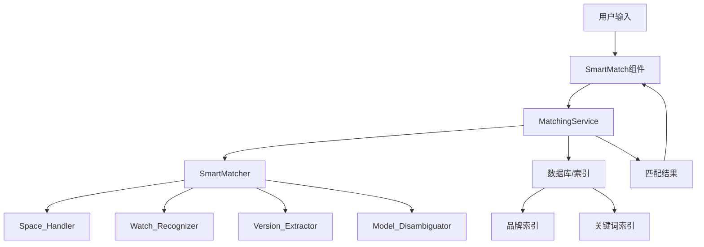

# 设计文档：智能匹配算法优化

## 概述

本设计文档描述了智能匹配算法优化功能的技术实现方案。该功能旨在解决当前智能匹配算法中存在的四类主要问题：

1. **型号名称空格处理问题**：输入的型号名称缺少或包含多余空格导致匹配失败
2. **手表产品型号识别问题**：手表产品的型号格式和属性顺序识别不准确
3. **同型号多SKU混淆问题**：无法区分相似型号（如X200 Pro vs X200 Pro mini）
4. **产品系列版本识别问题**：无法识别"活力版"等产品版本标识，且颜色匹配错误

优化方案将在现有的 `SmartMatcher` 类基础上进行改进，增强其标准化、提取和匹配能力。

## 架构

### 系统架构图



### 核心流程

1. **输入标准化**：使用 `Space_Handler` 标准化型号名称中的空格
2. **信息提取**：使用各个提取器提取品牌、型号、版本、颜色等信息
3. **候选筛选**：使用品牌索引快速筛选候选SKU
4. **相似度计算**：计算输入与候选SKU的相似度分数
5. **属性验证**：验证关键属性（品牌、型号、容量、颜色、版本）
6. **结果排序**：根据相似度和验证结果选择最佳匹配

## 组件和接口

### 1. Space_Handler（空格处理器）

**职责**：标准化型号名称中的空格

**接口**：
```typescript
class SpaceHandler {
  /**
   * 标准化型号名称中的空格
   * @param modelName 原始型号名称
   * @returns 标准化后的型号名称
   */
  normalizeSpaces(modelName: string): string;
  
  /**
   * 识别并处理品牌后的空格
   * @param str 输入字符串
   * @returns 处理后的字符串
   */
  private addSpaceAfterBrand(str: string): string;
  
  /**
   * 识别并处理型号后缀前的空格
   * @param str 输入字符串
   * @returns 处理后的字符串
   */
  private addSpaceBeforeSuffix(str: string): string;
}
```


**实现细节**：
- 识别常见品牌名称（IQOO、OPPO、VIVO、Hi等）并在品牌后添加空格
- 识别常见型号后缀（Pro、Max、Mini、Plus、Ultra、SE、Air、Turbo等）并在后缀前添加空格
- 处理特殊情况（如Ace系列、MateBook系列）
- 清理多余空格

### 2. Watch_Recognizer（手表识别器）

**职责**：识别和处理手表类产品

**接口**：
```typescript
class WatchRecognizer {
  /**
   * 判断是否为手表产品
   * @param productName 产品名称
   * @returns 是否为手表产品
   */
  isWatchProduct(productName: string): boolean;
  
  /**
   * 提取手表型号代码
   * @param productName 产品名称
   * @returns 型号代码（如WA2456C）
   */
  extractWatchModelCode(productName: string): string | null;
  
  /**
   * 提取手表属性
   * @param productName 产品名称
   * @returns 属性对象（表带材质、连接方式、颜色等）
   */
  extractWatchAttributes(productName: string): WatchAttributes;
  
  /**
   * 标准化手表属性顺序
   * @param attributes 属性对象
   * @returns 标准化后的属性字符串
   */
  normalizeWatchAttributes(attributes: WatchAttributes): string;
}

interface WatchAttributes {
  modelCode?: string;      // 型号代码（如WA2456C）
  connectionType?: string; // 连接方式（蓝牙版、eSIM版）
  strapMaterial?: string;  // 表带材质（软胶、皮革、金属）
  color?: string;          // 颜色
  size?: string;           // 尺寸（42mm、46mm等）
}
```

**实现细节**：
- 识别手表关键词（Watch、手表等）
- 提取型号代码（括号内的代码，如WA2456C）
- 识别手表特有属性（表带材质、连接方式）
- 按标准顺序排列属性：型号代码 > 连接方式 > 颜色 > 表带材质

### 3. Version_Extractor（版本提取器）

**职责**：提取产品版本标识

**接口**：
```typescript
class VersionExtractor {
  /**
   * 提取版本标识
   * @param productName 产品名称
   * @returns 版本标识（如"活力版"）
   */
  extractVersion(productName: string): string | null;
  
  /**
   * 判断两个版本是否匹配
   * @param version1 版本1
   * @param version2 版本2
   * @returns 是否匹配
   */
  versionsMatch(version1: string | null, version2: string | null): boolean;
}
```

**实现细节**：
- 识别常见版本标识词汇：活力版、标准版、青春版、至尊版、竞速版、极速版、全网通5G版等
- 使用正则表达式提取版本标识
- 标准化版本名称（去除空格、统一大小写）

### 4. Model_Disambiguator（型号消歧器）

**职责**：区分相似型号

**接口**：
```typescript
class ModelDisambiguator {
  /**
   * 提取完整型号（包括后缀）
   * @param productName 产品名称
   * @returns 完整型号（如"X200 Pro mini"）
   */
  extractFullModel(productName: string): string | null;
  
  /**
   * 判断两个型号是否完全匹配
   * @param model1 型号1
   * @param model2 型号2
   * @returns 是否完全匹配
   */
  modelsExactMatch(model1: string | null, model2: string | null): boolean;
  
  /**
   * 计算型号匹配分数
   * @param inputModel 输入型号
   * @param candidateModel 候选型号
   * @returns 匹配分数（0-1）
   */
  calculateModelMatchScore(inputModel: string | null, candidateModel: string | null): number;
}
```

**实现细节**：
- 提取型号时包含所有后缀（Pro、Max、Mini、Plus等）
- 将后缀视为型号的一部分而非可选属性
- 完全匹配返回1.0，部分匹配返回0.5，不匹配返回0.0
- 特殊处理：X200 Pro 不匹配 X200 Pro mini

### 5. Enhanced SmartMatcher（增强的智能匹配器）

**职责**：整合所有组件，执行智能匹配

**接口**：
```typescript
class EnhancedSmartMatcher extends SmartMatcher {
  private spaceHandler: SpaceHandler;
  private watchRecognizer: WatchRecognizer;
  private versionExtractor: VersionExtractor;
  private modelDisambiguator: ModelDisambiguator;
  
  /**
   * 增强的标准化方法
   * @param str 输入字符串
   * @returns 标准化后的字符串
   */
  enhancedNormalize(str: string): string;
  
  /**
   * 增强的相似度计算
   * @param input 输入产品名称
   * @param candidate 候选SKU名称
   * @returns 相似度分数（0-1）
   */
  calculateEnhancedSimilarity(input: string, candidate: string): number;
  
  /**
   * 增强的属性验证
   * @param input 输入产品名称
   * @param candidate 候选SKU
   * @returns 验证结果
   */
  validateEnhancedAttributes(input: string, candidate: GyCsvRow): ValidationResult;
}

interface ValidationResult {
  isValid: boolean;
  score: number;
  reasons: string[];
  details: {
    brandMatch: boolean;
    modelMatch: boolean;
    versionMatch: boolean;
    capacityMatch: boolean;
    colorMatch: boolean;
  };
}
```


## 数据模型

### 匹配上下文

```typescript
interface MatchingContext {
  // 输入信息
  input: {
    raw: string;                    // 原始输入
    normalized: string;             // 标准化后的输入
    brand: string | null;           // 品牌
    model: string | null;           // 型号
    fullModel: string | null;       // 完整型号（包括后缀）
    version: string | null;         // 版本标识
    capacity: string | null;        // 容量
    color: string | null;           // 颜色
    isWatch: boolean;               // 是否为手表
    watchAttributes?: WatchAttributes; // 手表属性
  };
  
  // 候选信息
  candidate: {
    row: GyCsvRow;                  // 候选SKU数据
    brand: string | null;           // 品牌
    model: string | null;           // 型号
    fullModel: string | null;       // 完整型号
    version: string | null;         // 版本标识
    capacity: string | null;        // 容量
    color: string | null;           // 颜色
    isWatch: boolean;               // 是否为手表
    watchAttributes?: WatchAttributes; // 手表属性
  };
  
  // 匹配结果
  result: {
    similarity: number;             // 相似度分数
    validation: ValidationResult;   // 验证结果
    threshold: number;              // 使用的阈值
  };
}
```

### 匹配配置

```typescript
interface MatchingConfig {
  // 基础阈值
  baseThreshold: number;            // 默认0.65
  
  // 产品类型阈值
  thresholds: {
    phone: number;                  // 手机：0.70
    watch: number;                  // 手表：0.72
    tablet: number;                 // 平板：0.65
    laptop: number;                 // 笔记本：0.68
    accessory: number;              // 配件：0.60
  };
  
  // 字段权重
  fieldWeights: {
    brand: number;                  // 品牌：0.30
    model: number;                  // 型号：0.40
    version: number;                // 版本：0.10
    capacity: number;               // 容量：0.10
    color: number;                  // 颜色：0.10
  };
  
  // 验证规则
  validationRules: {
    brandRequired: boolean;         // 品牌必须匹配
    modelRequired: boolean;         // 型号必须匹配
    versionRequired: boolean;       // 版本必须匹配（如果都有）
    capacityRequired: boolean;      // 容量必须匹配（如果都有）
    colorRequired: boolean;         // 颜色必须匹配（如果都有）
  };
}
```

## 正确性属性

*属性是一个特征或行为，应该在系统的所有有效执行中保持为真——本质上是关于系统应该做什么的正式陈述。属性作为人类可读规范和机器可验证正确性保证之间的桥梁。*


### 属性 1：空格标准化幂等性

*对于任何*型号名称字符串，多次应用空格标准化应该产生相同的结果（幂等性）。

**验证：需求 1.1, 1.2, 1.3**

### 属性 2：型号后缀识别完整性

*对于任何*包含常见型号后缀（Pro、Max、Mini、Plus、Ultra、SE、Air、Turbo）的型号名称，空格处理器应该在后缀前添加空格。

**验证：需求 1.4**

### 属性 3：品牌型号分隔

*对于任何*品牌+型号代码的组合，空格处理器应该在品牌与型号之间添加空格。

**验证：需求 1.5**

### 属性 4：手表产品识别

*对于任何*包含手表关键词（Watch、手表等）的产品名称，手表识别器应该将其识别为手表类型。

**验证：需求 2.1**

### 属性 5：手表型号代码提取

*对于任何*包含括号内型号代码的手表产品名称，手表识别器应该正确提取型号代码。

**验证：需求 2.2**

### 属性 6：手表属性顺序不变性

*对于任何*手表产品，无论输入的属性顺序如何，标准化后应该按照固定顺序排列（型号代码 > 连接方式 > 颜色 > 表带材质）。

**验证：需求 2.3, 2.4, 2.5**

### 属性 7：型号精确匹配排他性

*对于任何*完整型号名称（如"X200 Pro"），匹配算法不应该匹配到包含额外后缀的型号（如"X200 Pro mini"）。

**验证：需求 3.1, 3.2, 3.4**

### 属性 8：型号匹配分数单调性

*对于任何*两个型号，完全匹配的相似度分数应该高于部分匹配，部分匹配应该高于不匹配。

**验证：需求 3.3, 3.5**

### 属性 9：版本标识提取

*对于任何*包含版本标识词汇（活力版、标准版、青春版、至尊版、竞速版、极速版）的产品名称，版本提取器应该正确提取版本标识。

**验证：需求 4.1, 4.3**

### 属性 10：版本匹配优先级

*对于任何*包含版本标识的输入产品，在多个候选SKU中，版本匹配的候选项应该获得更高的相似度分数。

**验证：需求 4.2, 4.4, 4.5**

### 属性 11：颜色信息提取

*对于任何*包含颜色词汇的产品名称，匹配算法应该正确提取颜色信息。

**验证：需求 5.1**

### 属性 12：颜色同义词等价性

*对于任何*颜色同义词对（如"雾凇"与"雾松"），匹配算法应该将它们视为等价。

**验证：需求 5.3**

### 属性 13：颜色匹配必要性

*对于任何*输入和候选SKU都包含颜色信息的情况，颜色不匹配应该导致相似度分数显著降低或匹配失败。

**验证：需求 5.2, 5.4**

### 属性 14：产品类型阈值差异性

*对于任何*两种不同的产品类型（如手表vs手机），匹配算法应该使用不同的匹配阈值。

**验证：需求 6.1**

### 属性 15：字段类型阈值调整

*对于任何*匹配操作，SKU名称字段应该使用比SPU名称字段更高的阈值。

**验证：需求 6.4, 6.5**

### 属性 16：关键属性验证完整性

*对于任何*候选匹配，匹配算法应该验证所有关键属性（品牌、型号、容量、颜色、版本），并在任何属性不匹配时降低相似度分数或拒绝候选项。

**验证：需求 7.1, 7.2, 7.3, 7.4, 7.5, 7.6**

## 错误处理

### 输入验证错误

- **空输入**：当输入为空或仅包含空格时，返回未匹配状态
- **无效字符**：当输入包含特殊字符或控制字符时，进行清理后再处理
- **超长输入**：当输入超过合理长度（如1000字符）时，截断处理

### 数据提取错误

- **品牌提取失败**：当无法提取品牌时，使用全局搜索而非品牌过滤
- **型号提取失败**：当无法提取型号时，降级使用关键词匹配
- **颜色提取失败**：当无法提取颜色时，忽略颜色验证

### 匹配错误

- **无候选项**：当品牌过滤后无候选项时，返回未匹配状态
- **多个高分候选项**：当多个候选项分数相近时，选择第一个（按数据库顺序）
- **阈值边界情况**：当分数恰好等于阈值时，视为匹配成功

### 性能错误

- **超时**：当单次匹配超过5秒时，返回超时错误
- **内存不足**：当内存使用超过限制时，清理缓存并重试
- **索引构建失败**：当索引构建失败时，降级使用线性搜索

## 测试策略

### 单元测试

单元测试用于验证各个组件的具体功能和边界情况：

1. **Space_Handler 测试**
   - 测试各种空格缺失情况
   - 测试多余空格清理
   - 测试特殊品牌和型号组合

2. **Watch_Recognizer 测试**
   - 测试手表产品识别
   - 测试型号代码提取
   - 测试属性排序

3. **Version_Extractor 测试**
   - 测试各种版本标识提取
   - 测试版本匹配逻辑

4. **Model_Disambiguator 测试**
   - 测试型号精确匹配
   - 测试相似型号区分

5. **集成测试**
   - 测试40个真实错误案例
   - 验证每类问题的修复效果

### 属性测试

属性测试用于验证系统的通用正确性属性，每个测试至少运行100次：

1. **属性 1-3：空格标准化**
   - 生成随机型号名称（有/无空格、多余空格）
   - 验证标准化的幂等性和正确性

2. **属性 4-6：手表识别**
   - 生成随机手表产品名称
   - 验证识别、提取和排序的正确性

3. **属性 7-8：型号消歧**
   - 生成随机型号对（完全匹配、部分匹配、不匹配）
   - 验证匹配的排他性和分数单调性

4. **属性 9-10：版本识别**
   - 生成包含版本标识的产品名称
   - 验证提取和优先级

5. **属性 11-13：颜色匹配**
   - 生成包含颜色的产品名称
   - 验证提取、同义词和必要性

6. **属性 14-15：阈值调整**
   - 生成不同产品类型和字段类型
   - 验证阈值差异性

7. **属性 16：属性验证**
   - 生成随机产品对（属性匹配/不匹配）
   - 验证验证逻辑的完整性

### 测试配置

- **属性测试库**：使用 fast-check（TypeScript）
- **最小迭代次数**：100次/属性
- **标签格式**：`Feature: smart-match-optimization, Property {number}: {property_text}`
- **测试文件位置**：`__tests__/smart-match-optimization/`

### 测试数据

使用用户提供的40个真实错误案例作为回归测试数据：
- 8个型号名称空格处理问题案例
- 4个手表产品型号识别问题案例
- 2个同型号多SKU混淆问题案例
- 6个产品系列版本识别问题案例
- 其他20个混合问题案例

目标：在40个测试案例中达到至少95%的匹配准确率（38/40）。
